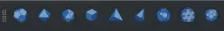
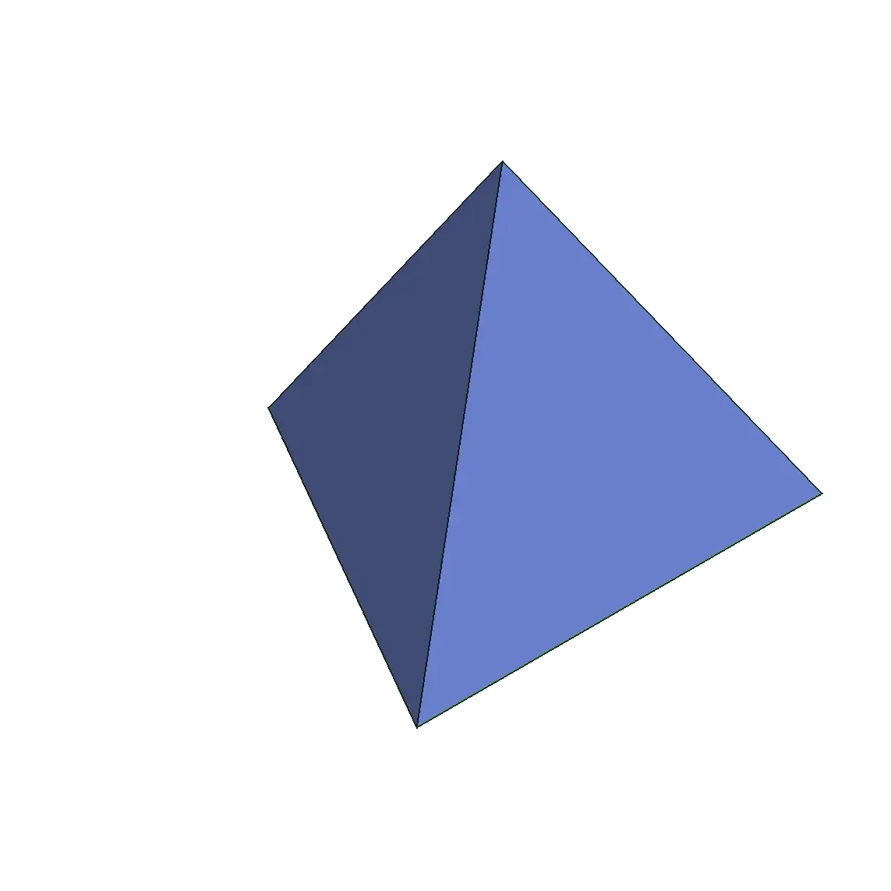
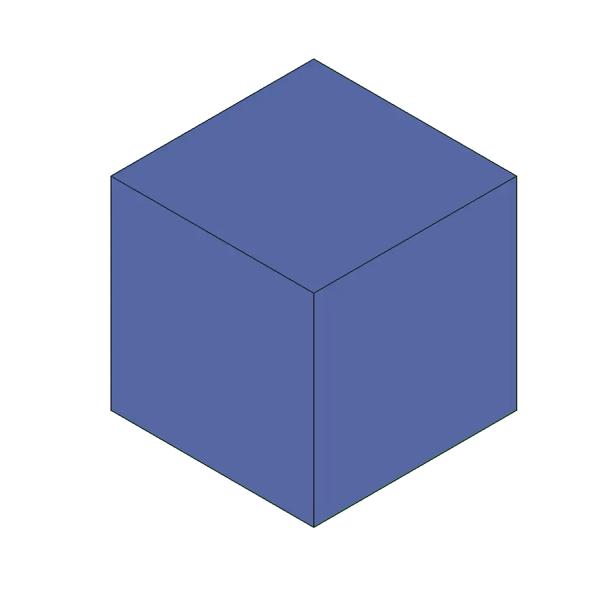
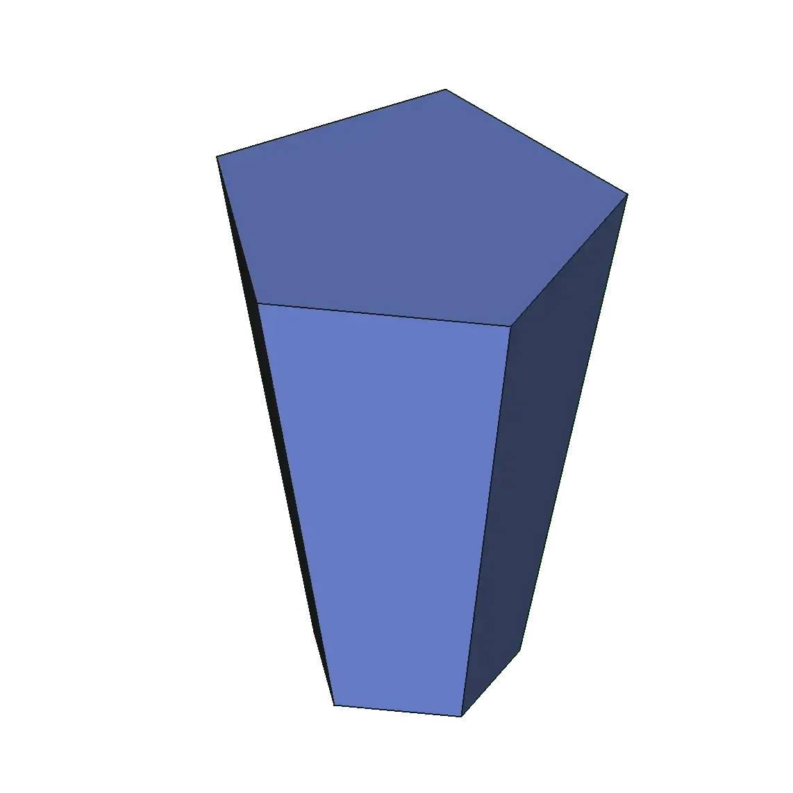
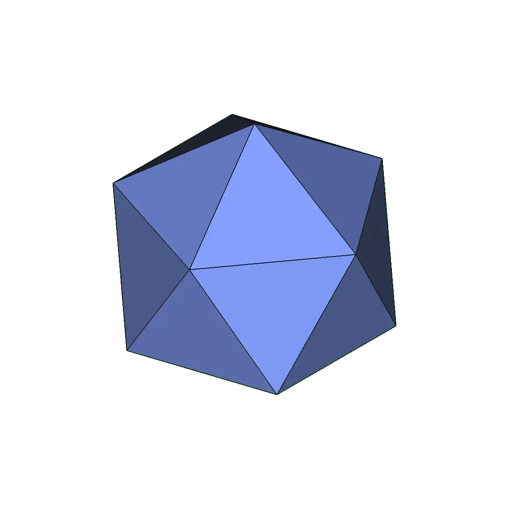
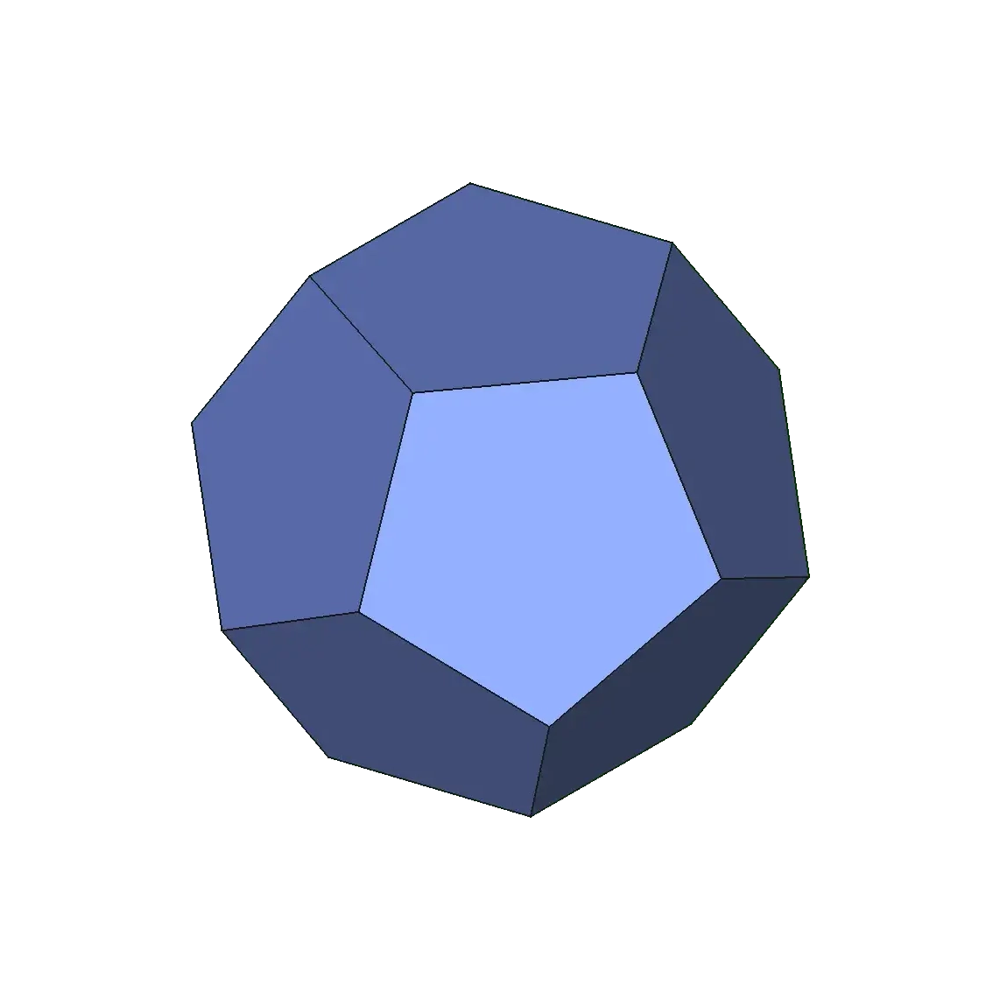
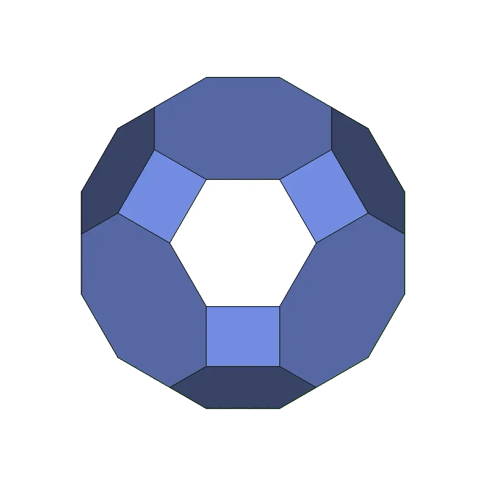
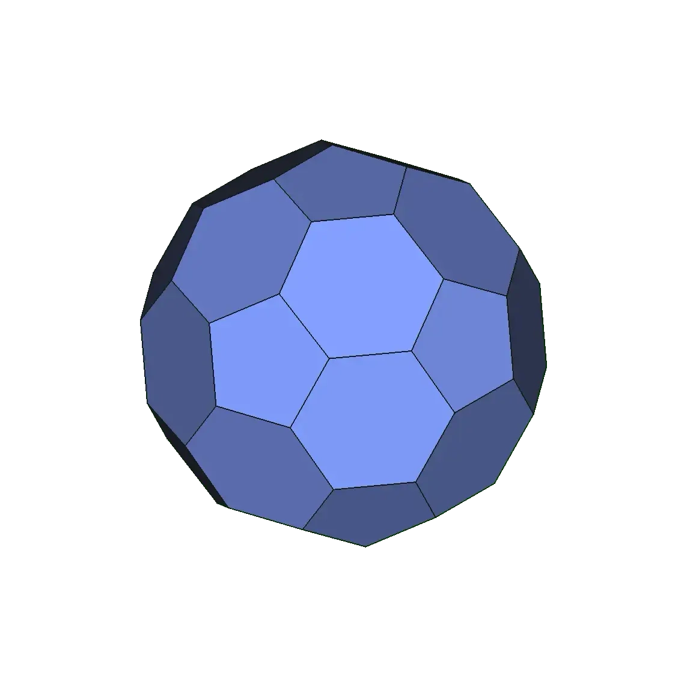
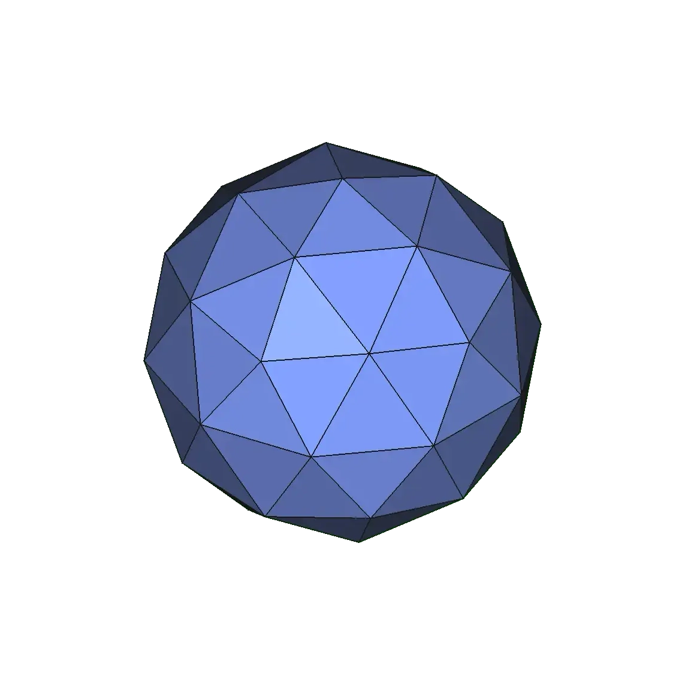

# Polyhedra

Integrates a toolbar for creating various  
Polyhedrons into the Part workbench.

 

## Shapes

The following shapes can be generated:

<table>
<tr>
<td align = 'center' >

**Tetrahedron**

</td>
<td align = 'center' >

**Hexahedron**

</td>
<td align = 'center' >

**Pyramid**

</td>
</tr>
<tr>
<td align = 'center' >

**Octahedron**

</td>
<td align = 'center' >

**Icosahedron**

</td>
<td align = 'center' >

**Dodecahedron**

</td>
</tr>
<tr>
<td align = 'center' >

**Regular**   **Solid**

</td>
<td align = 'center' >

**Truncated**   **Icosahedron**

</td>
<td align = 'center' >

**Geodesic**   **Sphere**

</td>
</tr>
</table>

 

## Usage

-   Install the addon
-   Open a new document
-   Navigate to the `Part` workbench
-   Use one of the Polyhedra tools
-   Configure shape in the model editor

 

## Tutorials
*( For previous versions )*
- [Pyramids use and possibilities](https://youtu.be/H8IgmzpMpSg) 
- [Editing polyhedrons in PartDesign](https://youtu.be/Lym1jM_Vans)
- [More advanced, build a model of a geodesic dome](https://youtu.be/FsYHYnVcVvI) 

 