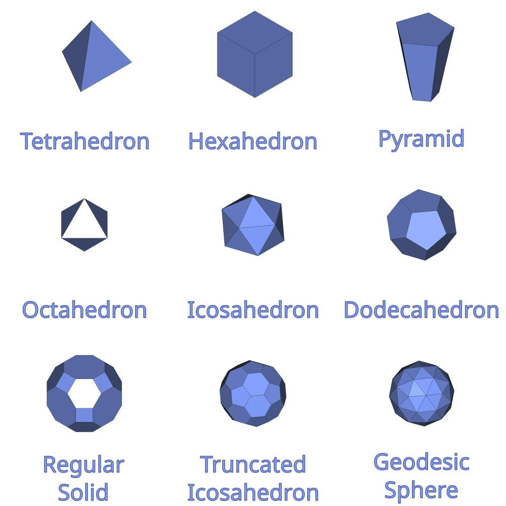

# Polyhedra

Integrates a toolbar for creating various  
Polyhedrons into the Part workbench.

 

## Shapes

The following shapes can be generated:

 

## Usage

-   Install the addon
-   Open a new document
-   Navigate to the `Part` workbench
-   Use one of the Polyhedra tools
-   Configure shape in the model editor

 
